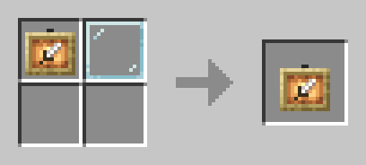
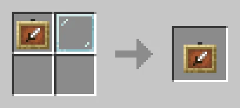
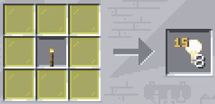

# Новые крафты

🛠️ Расширенный список рецептов для улучшения игрового процесса.

## Ребаланс крафтов

Баланс создания некоторых предметов изменён на более справедливый. Изменения затронули рельсы, цепи, люки и прочее.

## Новые рецепты

* **Кожа** — переплавьте в печи гнилую плоть.
* **Чёрный краситель** — из каменного и древесного угля.
* **Энергорельсы** — теперь можно создать из меди.

## Невидимые рамки

Невидимые рамки станут отличным помощником при декорировании.

*Светящаяся рамка*

*Обычная рамка*

## Невидимый свет

Создайте невидимые блоки света, чтобы осветить тёмные участки и не заставлять всё факелами (используется только жёлтое стекло).

---

**Смотрите также:**

* [Улучшенный камнерез](improved-stonecutter.md)
* [Разжатие блоков](uncompression.md)
* [Кристалл Края](end-crystal-craft.md)
