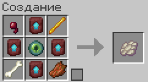

# Улучшитель спавнеров

⚙️ Теперь вы можете улучшать параметры найденных спавнеров мобов. Для этого понадобится специальный предмет — **«Улучшитель спавнеров»**.

## Эффекты улучшения

При применении на спавнере происходят следующие изменения:

* скорость спавна увеличивается в **1.5 раза**;
* максимальное количество мобов за один цикл спавна возрастает с **4 до 6**.

---

**Смотрите также:**

* [Новые крафты](../crafting/new-crafts.md)
