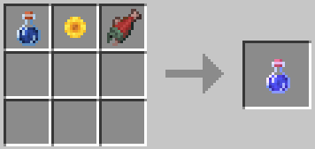

# Зелье Возврата

🧪 Аналог команды `/home` без использования стандартных систем быстрого перемещения.

Установите точку возрождения с помощью кровати — именно к ней зелье будет перемещать вас при использовании.

## Как использовать

1. Установите точку возрождения с помощью кровати.
2. Создайте зелье.
3. Используйте зелье — оно переместит вас к точке возрождения.

## Крафт зелья

Вам понадобится сырой лосось, бутылочка воды и подсолнух.

---

**Смотрите также:**

* [Канаты и зиплайны](ropes-ziplines.md)
